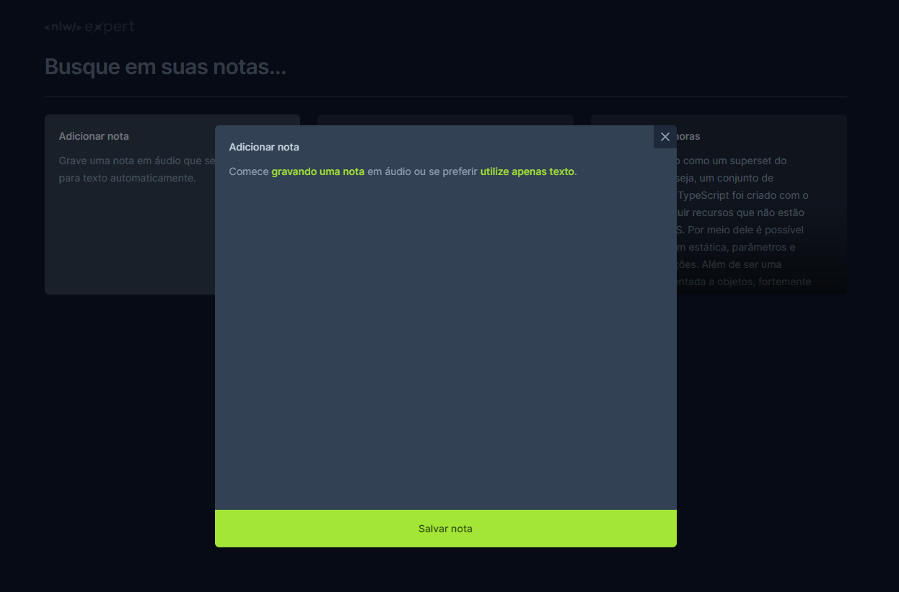
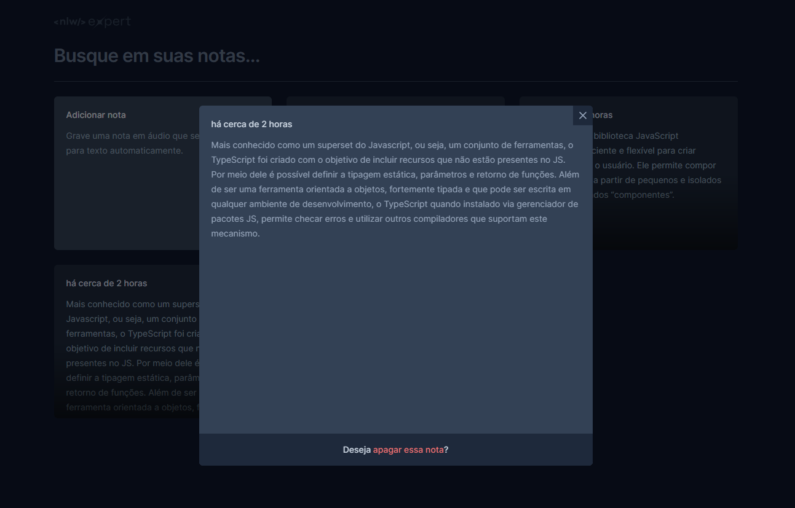
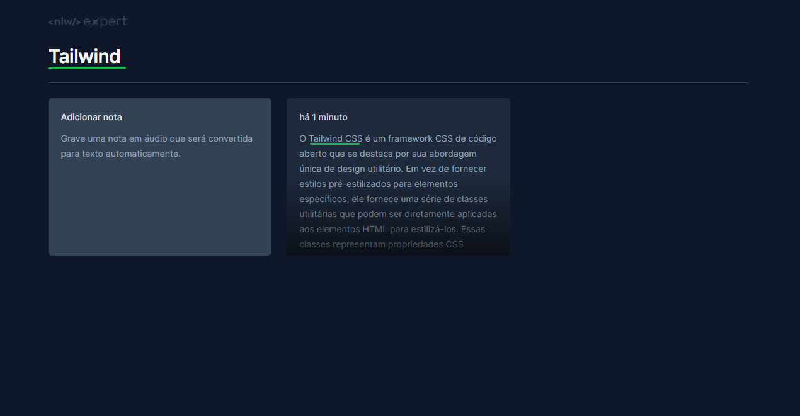

<h1 align="center" style="text-align: center;">
  Expert Notes
</h1>

<p align="center">
 🚀 Aplicação realizada na trilha React da NLW Expert pela plataforma Rocketseat 🚀
</p>

<p align="center">
  <a href="#project">Projeto</a>&nbsp;&nbsp;&nbsp;|&nbsp;&nbsp;&nbsp;
  <a href="#technologies">Tecnologias</a>&nbsp;&nbsp;&nbsp;|&nbsp;&nbsp;&nbsp;
  <a href="#usage">Utilização</a>&nbsp;&nbsp;&nbsp;|&nbsp;&nbsp;&nbsp;
  <a href="#author">Autor</a>
</p>

<h2 id='project'>📁 Projeto</h2>

Esse projeto possiblita o gerenciamento de anotações.

As anotações podem ser adicionadas via texto ou aúdio, deletadas ou filtradas.







<h2 id="technologies">💻 Tecnologias</h2>

Esse projeto foi desenvolvido com as seguintes tecnologias:

- **[Vite](https://vitejs.dev)**
- **[React](https://react.dev/reference/react)**
- **[TypeScript](https://www.typescriptlang.org)**
- **[Tailwind CSS](https://tailwindcss.com/docs/installation/framework-guides)**
- **[Radix UI](https://www.radix-ui.com/primitives)**
- **[SpeechRecognition API](https://developer.mozilla.org/en-US/docs/Web/API/SpeechRecognition)**

<h2 id='usage'>💡 Utilização</h2>

1. Clonar o repositório
```
$ git clone https://github.com/madalena-rocha/nlw-expert
```

2. Instalar as dependências
```
$ npm install
```

3. Iniciar o servidor
```
$ npm run dev
```

<h2 id='author'>👨‍💻 Autor</h2>

Matheus Henrique Jacob dos Santos

<div style="display: flex;">
  <a href="https://www.linkedin.com/in/matheus-henrique-jacob/" target="_blank"></a>
  <a href="mailto:math.henrique.jacob@gmail.com"></a>
</div>